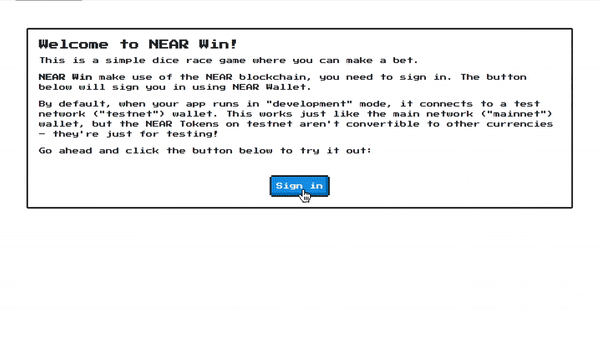

NEAR Win!
==================

NEAR Win! Es un pequeño juego con estilo de carreras de caballos en el que el resultado de la carrera se decide por medio de turnos y un dado virtual. Si elegiste al jugador que llegue primero al final, ganarás.

Esta aplicación [React] fue creada con [create-near-app]

Como empezar
===========

Para correr este proyecto localmente:

1. Prerequisitos: Asegurate de tener instalado [Node.js] ≥ 12
2. Instala las dependencias con: `yarn install`
3. Corre el servidor localmente: `yarn dev` (puedes ver el `package.json` para la lista completa de `scripts` que puedes correr con `yarn`)

Explora el código
==================

1. Los contratos se encuentran en la carpeta `/contract`.
   * `addRace` es el contrato que se usa para agregar el resultado de una carrera, contiene el nombre de la cuenta logueada, el jugador que elegiste, el ganador de la carrera, y el resultado (ganaste o perdiste).
   * `getRaces` es el contrato que se usa para obtener todas las carreras (con un límite de las últimas 10 carreras).
2. El frontend está en la carpeta `/src`.
3. Tests: Los tests los puedes correr con el comando `yarn
   test`. Hay dos tipos de tests, los de los contratos y los de el frontend cuando manda llamar las funciones de los contratos.

Screenshots
==================

  [React]: https://reactjs.org/
  [create-near-app]: https://github.com/near/create-near-app
  [Node.js]: https://nodejs.org/en/download/package-manager/